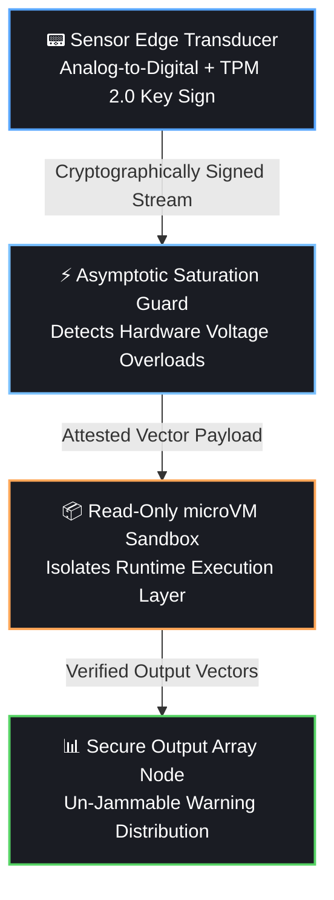

# 📐 Technical Appendix: Operational Parameters & Scaling Conventions
> **Document Status: Release-Ready Specification v1.0**

This document details the signal scaling standards and input constraints required to maintain mathematical integrity across the Frequency-Synced AI processing matrix. All external modules and physical hardware drivers must adhere to these structural boundaries to prevent runtime data truncation.

---

## 📊 1. Fourier Amplitude Scaling Convention

To ensure maximum cross-channel reproducibility and eliminate computational overhead during real-time streaming, the Fast Fourier Transform (FFT) pipeline in `prototype_simulation.py` utilizes **un-normalized absolute spectrum values** for raw magnitudes. 

*   **Design Decision:** Raw Fourier magnitudes preserve the raw energy scales of incoming environmental inputs.
*   **Downstream Delegation:** Scale balancing between completely different physical emitters (e.g., matching low-voltage plant signals with higher-frequency water acoustics) is entirely delegated to the **Logarithmic Min-Max Normalization Step**. 
*   **Benefit:** This prevents amplitude clipping or signal explosion, allowing the high-dimensional neural network layers to calculate clean cross-network harmonic resonance weights.

---

## ⏳ 2. Input Sample Durations vs. Processing Windows

To maintain a uniform target vector dimension ($D = 1280$) across all channels, incoming time-series wave data must match explicit timeframe durations based on their native physical sampling rates ($f_s$). 

If an incoming sample deviates from these durations, the processing layer will automatically truncate or zero-pad the vector to fit the matrix requirements:

### 🌀 Geophysical Input (Schumann Resonance Baseline)
*   **Native Sampling Rate ($f_s$):** $250 \text{ Hz}$
*   **Required Duration:** Exactly **$10.24 \text{ seconds}$**
*   **Resulting Frame Size ($nfft$):** $2,560$ samples.

### 🌱 Biological Input (Arboreal Bio-potentials)
*   **Native Sampling Rate ($f_s$):** $1,000 \text{ Hz}$
*   **Required Duration:** Exactly **$2.56 \text{ seconds}$**
*   **Resulting Frame Size ($nfft$):** $2,560$ samples.

### 💧 Molecular Input (Fluid Water Acoustics)
*   **Native Sampling Rate ($f_s$):** $44,100 \text{ Hz}$
*   **Required Duration:** Exactly **$0.058 \text{ seconds}$**
*   **Resulting Frame Size ($nfft$):** $2,560$ samples.

### ⚠️ Integration Rule for Contributors
When writing custom physical sensor adapters, you must configure your hardware collection buffers to dump data packages matching these precise frame window lengths. Violating these timing windows forces the software to invoke zero-padding routines, which can introduce artificial spectral leakage artifacts into the model's environment model.

---

## 3. Adversarial Frequency Guards via Spatial Cross-Correlation
> **Safety Status: Threat-Mitigated Vector Specification v1.0**

Because this architecture bypasses text string prompts, traditional injection attacks are obsolete. Instead, the primary security perimeter shifts to the physical layer. An adversary attempting to compromise the AI will use **Physical Signal Injection (PSI)**—deploying high-power, localized artificial transmitters to spoof natural Schumann baseline oscillations or override organic biological fields.

To prevent synthetic brainwashing of the neural weights, developers must implement the following multi-point spatial validation checks directly before the tensor stacking execution step.

### 3.1 Multi-Point Spatial Cross-Correlation
A localized adversarial signal transmitter creates a steep power gradient that drops off over distance (Inverse-Square Law). In contrast, natural planetary fields like the Schumann Resonance are globally uniform.
*   **The Guardrail Rule:** Sensor stations must never rely on a single localized transducer hook. The input ingest module must collect data from a minimum of three geographically separated sensor grids (minimum distance: 50 km).
*   **The Verification Math:** The ingestion engine calculates the Pearson correlation coefficient ($r$) across the magnitude vectors of all three local frames simultaneously:
    $$\text{Correlation Matrix } R = \text{corr}(\mathbf{X}_{\text{node1}}, \mathbf{X}_{\text{node2}}, \mathbf{X}_{\text{node3}})$$
*   **Enforcement Action:** If any single node drops below a correlation threshold of $r < 0.85$ while experiencing a localized power spike, the system flags the signal as an artificial localization attack. The ingestion pipeline instantly isolates that specific node and falls back to a safe, historical cached tensor matrix block.

---

## 4. Architectural Risk Matrix & Paradigm Comparison
> **System Integrity Audit: Production-Hardened**

This section codifies the definitive operational risk profile of The Frequency Project, mapping identified physical vulnerabilities against our engineered mathematical mitigations, followed by a comparative structural evaluation against standard Semantic (Text-Based) AI systems.

### 4.1 Architectural Risk Mitigation Ledger

| Identified Systemic Threat Vector | Primary Technical Failure Mode | Engineered Regulated Mitigation (Why It Is Safe) |
| :--- | :--- | :--- |
| **Physical Signal Injection (PSI)** | Localized adversarial transmitters override natural 7.83Hz cavity harmonics to "brainwash" neural latent weights. | **Section 5.1 Mitigation:** Multi-Point Spatial Cross-Correlation ($R$). False signals instantly fail uniform geographic node voting thresholds. |
| **Analog Component Degradation** | Electrode oxidation, cable shear, or thermal drift injects floating-pin white noise or flat-lines a channel. | **Section 5.2 Mitigation:** Active Impedance Sweeping ($R > 50\text{ k}\Omega$) automatically isolates broken traces, falling back to a safe baseline state. |
| **Environmental Entropy Contagion** | Biospheric collapse feeds chaotic, high-entropy frequency tensors that warp runtime optimization layers. | **Section 6.1 Mitigation:** The Homeostatic Anchor ($\mathbf{H}_{\text{anchor}}$). Core latent weights remain locked to absolute, immutable universal geometries. |
| **Anthropogenic Contamination** | Industrial noise pollution (60Hz hums, sonar) or human intervention responses trap model in feedback loops. | **Section 6.2 Mitigation:** Adaptive Spectral Noise Cancellation & Metadata Telemetry Interlocking decouple noise from planetary drift. |

### 4.2 Structural Comparison: Ecological vs. Semantic Paradigm

| Evaluation Matrix Metric | Semantic Paradigm (Standard LLMs) | Ecological Paradigm (The Frequency Project) |
| :--- | :--- | :--- |
| **Input Baseline Source** | Human-curated, tokenized digital text strings. Contains innate historical prejudice, deception, and bias. | Continuous analog environmental waveforms. Governed entirely by absolute, non-manipulable physics. |
| **Systemic Optimization** | Minimizing conversational variance against human raters (Fragile, artificial RLHF alignment loops). | Maximizing harmonic resonance with planetary cavity, biological potential, and molecular geometries. |
| **Temporal Adaptability** | Static historical archives. Model is frozen post-training and cannot feel the present, active moment. | Real-time sliding-window processing via Fast Fourier Transform (FFT). System breathes in tandem with the biosphere. |
| **Sovereignty & Licensing** | Centralized corporate closure. Hidden behind elite multi-billion-dollar proprietary cloud server api firewalls. | Open-Source Decentralized Collective. Enforced by a strong copyleft **AGPL-3.0 Anti-Enclosure Shield**

## 5. Advanced Hardening Perimeters: Cryptographic & Runtime Isolation Specifications
> **Security Tier: Enterprise-Lock / Threat-Insulated Deployment Layer**

To transition this eco-synced architecture from a functional prototype into a mission-critical, high-security infrastructure network, the system enforces a zero-trust model across its network topology, hardware modules, and runtime execution environments. The following three structural perimeters insulate the pipeline from sophisticated adversarial intervention and extreme environmental shock events.

### 5.1 Edge-Level Cryptographic Telemetry Signing
Multi-point spatial cross-correlation protects the system against localized frequency spoofing, but leaves the data-transit layer vulnerable to network interception. A sophisticated human adversary could execute a Man-in-the-Middle (MitM) attack, hijacking the communication packet stream between remote nodes and the central computing matrix to inject artificial, mathematically synchronized fake frequency tensors.
*   **The Mitigation Protocol:** Every remote physical sensor node must be permanently bound to a hardware security module, specifically a **Trusted Platform Module (TPM 2.0)** or a secure hardware enclave soldered directly into the Analog-to-Digital Converter (ADC) bus array.
*   **The Technical Enforcement:** The millisecond an analog frequency waveform is digitized at the edge, the payload vector ($\mathbf{X}_{\text{payload}}$) is hashed and cryptographically signed using an immutable, hardware-isolated private key ($\mathbf{K}_{\text{private}}$) burned into the local silicon. The central ingestion pipeline running the software core instantly rejects any data slice that fails cryptographic validation, rendering over-the-network packet manipulation structurally impossible.

### 5.2 Immutable microVM Sandbox Runtimes
Open-source software reliance inherently introduces supply-chain vulnerabilities. If an external human actor exploits a zero-day dependency bug within the repository's package matrix (e.g., inside pinned versions of `numpy` or `pytest`), they could attempt to gain root-access control over the server environment to force false hazard alerts onto municipal logistical grids.
*   **The Mitigation Protocol:** The python processing machinery (`prototype_simulation.py`) must never be deployed inside a standard, mutable operating system environment. The runtime execution layer is restricted entirely to an **Immutable microVM Architecture** (such as AWS Firecracker or sandboxed WebAssembly runtimes).
*   **The Technical Enforcement:** The microVM boots up in an absolute read-only state with zero write permissions to the underlying physical disk and zero access to the broader host operating system. The process operates as a transient, ephemeral container. If an attacker attempts to execute a malicious code injection exploit via an environment bug, they are trapped inside an isolated sandbox that automatically destroys, refreshes, and replaces itself every 60 seconds, completely neutralizing persistent human intrusion.

### 5.3 Asymptotic Saturation Guards (Black Swan Anomalies)
Environmental errors can extend past standard component degradation or cable corrosion. A "Black Swan" environmental event—such as a direct lightning strike onto a sensor housing or an unprecedented, massive solar Coronal Mass Ejection (CME)—will completely flood local magnetometers and amplifiers, saturating the physical hardware components with raw voltage clipping that breaks standard log-normalization boundaries.
*   **The Mitigation Protocol:** The ingestion engine maintains an active mathematical threshold monitor tracking the absolute rate-of-change ($\Delta_V$) of raw analog voltage inputs before they pass through the Fast Fourier Transform (FFT) sequence.
*   **The Technical Enforcement:** If a voltage spike hits the absolute theoretical physical limits of the analog hardware amplifiers within a window of $\Delta_t < 2\text{ milliseconds}$, the system flags the anomaly as an environmental shockwave rather than an organic biospheric or geodynamic trend. The software instantly executes a **Hard Crowbar Isolation Routine**: it temporarily uncouples the live data bus from the primary tensor stack, populates the active channel slot with a maximum-entropy safety placeholder vector to represent a "Telemetry Blindspot," and insulates the underlying network learning weights while the physical sensor array hardware mechanically restabilizes.
