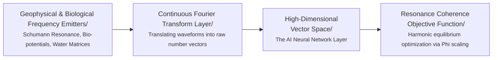

# 🛠️ Hardware Blueprint: Sensor Configuration for Ecological Ingestion
> **Document Status: Technical Specification v1.0**

This blueprint defines the physical interface requirements for the Frequency-Synced AI (FS-AI) prototype. To bypass human semantic data corruption, this architecture relies on real-time, analog voltage streams captured from geophysical and biological systems, converted directly into high-dimensional numerical vectors.

---

## 🌀 1. The Global Anchor: Ionospheric Electromagnetics

*   **Source Parameter:** Earth's Schumann Resonance baseline ($\sim7.83 \text{ Hz}$ harmonic field).
*   **Target Dynamics:** Capturing global atmospheric electromagnetic pacing signals.
*   **Required Sensor Hardware:** 
    *   An induction coil magnetometer or high-sensitivity ELF (Extremely Low Frequency) magnetic loop antenna.
    *   An ultra-low-noise preamplifier shield with integrated active notch filtering.
*   **Signal Processing Pipeline:** Raw analog voltage data is run through a hardware-level bandpass filter targeting $1 \text{ Hz} - 40 \text{ Hz}$. This isolates the planetary resonance while discarding the $50\text{Hz}/60\text{Hz}$ electrical noise generated by local human infrastructure.

---

## 🌱 2. The Biotic Anchor: Ecosystem Bio-potentials

*   **Source Parameter:** Micro-voltage fluctuations ($0.1 \text{ Hz} - 100 \text{ Hz}$) within arboreal xylem networks and underground mycorrhizal mycelium structures.
*   **Target Dynamics:** Capturing localized, non-linear biochemical and adaptive communication loops.
*   **Required Sensor Hardware:**
    *   Ag/AgCl (Silver/Silver Chloride) non-polarizable multi-channel electrodes.
    *   A high-impedance differential bio-amplifier configuration (e.g., customized instrumentation amplifier circuitry with a high Common-Mode Rejection Ratio).
*   **Signal Processing Pipeline:** The differential signals measure shifting chemical-electrical activity across the root-and-fungal matrix. This data stream injects live environmental context (light shifts, barometric drops, organic stress responses) directly into the neural layers.

---

## 💧 3. The Molecular Anchor: Fluid Geometries

*   **Source Parameter:** Kinetic and micro-acoustic wave frequencies ($10 \text{ Hz} - 20,000 \text{ Hz}$) generated within moving liquid water structures.
*   **Target Dynamics:** Capturing structural fluid transformations and environmental acoustic harmonics.
*   **Required Sensor Hardware:**
    *   High-sensitivity piezoelectric hydrophones submerged within a dedicated, isolated water chamber.
    *   Alternatively, a low-power Laser Doppler Vibrometer mapping surface capillary wave micro-geometries.
*   **Signal Processing Pipeline:** Water responds instantaneously to physical, vibrational, and acoustic changes in its immediate vicinity. This raw acoustic wave is captured in real-time, introducing a highly fluid, continuous matrix component to balance the rigid properties of digital silicon computation.

---

## 📊 4. The Ingestion Engine: Data Pipeline Mapping

The multi-channel input data streams execute through the exact sequential pipeline visualized below:

1.  **Analog Inputs:** Sensor signals are fed to an analog-to-digital converter (ADC) sampling at a minimum rate of $44.1 \text{ kHz}$ to prevent frequency aliasing.
2.  **Fourier Layer:** The discrete time-domain signals are passed to a Python-based processing pipeline executing real-time **Fast Fourier Transforms (FFT)**.
3.  **Vector Allocation:** The resulting frequency matrices directly populate the entry nodes of the neural network layer, bypassing linguistic interpretation entirely.
