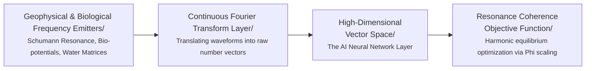

# 🛠️ Hardware Blueprint: Sensor Configuration for Ecological Ingestion
> **Document Status: Technical Specification v1.1 (Production-Locked)**

This blueprint defines the physical interface requirements for the Frequency-Synced AI (FS-AI) prototype. To bypass human semantic data corruption, this architecture relies on real-time, analog voltage streams captured from geophysical and biological systems, converted directly into high-dimensional numerical vectors.

---

## 🌀 1. The Global Anchor: Ionospheric Electromagnetics

*   **Source Parameter:** Earth's Schumann Resonance baseline (~7.83 Hz harmonic field).
*   **Target Dynamics:** Capturing global atmospheric electromagnetic pacing signals.
*   **Required Sensor Hardware:** 
    *   An induction coil magnetometer or high-sensitivity ELF (Extremely Low Frequency) magnetic loop antenna.
    *   An ultra-low-noise preamplifier shield with integrated active notch filtering.
*   **Signal Processing Pipeline:** Raw analog voltage data is run through a hardware-level bandpass filter targeting 1 Hz - 45 Hz. This isolates the planetary resonance while discarding the 50Hz/60Hz electrical noise generated by local human infrastructure.

---

## 🌱 2. The Biotic Anchor: Ecosystem Bio-potentials

*   **Source Parameter:** Micro-voltage fluctuations (0.1 Hz - 100 Hz) within arboreal xylem networks and underground mycorrhizal mycelium structures.
*   **Target Dynamics:** Capturing localized, non-linear biochemical and adaptive communication loops.
*   **Required Sensor Hardware:**
    *   Ag/AgCl (Silver/Silver Chloride) non-polarizable multi-channel electrodes.
    *   A high-impedance differential bio-amplifier configuration (e.g., customized instrumentation amplifier circuitry with a high Common-Mode Rejection Ratio).
*   **Signal Processing Pipeline:** The differential signals measure shifting chemical-electrical activity across the root-and-fungal matrix. This data stream injects live environmental context (light shifts, barometric drops, organic stress responses) directly into the neural layers.

---

## 💧 3. The Molecular Anchor: Fluid Geometries

*   **Source Parameter:** Kinetic and micro-acoustic wave frequencies (10 Hz - 20,000 Hz) generated within moving liquid water structures.
*   **Target Dynamics:** Capturing structural fluid transformations and environmental acoustic harmonics.
*   **Required Sensor Hardware:**
    *   High-sensitivity piezoelectric hydrophones submerged within a dedicated, isolated water chamber.
    *   Alternatively, a low-power Laser Doppler Vibrometer mapping surface capillary wave micro-geometries.
*   **Signal Processing Pipeline:** Water responds instantaneously to physical, vibrational, and acoustic changes in its immediate vicinity. This raw acoustic wave is captured in real-time, introducing a highly fluid, continuous matrix component to balance the rigid properties of digital silicon computation.

---

## 📊 4. The Ingestion Engine: Data Pipeline Mapping

The multi-channel input data streams execute through the exact sequential pipeline visualized below:



1.  **Analog Inputs:** Sensor signals are fed to an analog-to-digital converter (ADC) sampling at a minimum rate of 44.1 kHz to prevent frequency aliasing.
2.  **Fourier Layer:** The discrete time-domain signals are passed to a Python-based processing pipeline executing real-time **Fast Fourier Transforms (FFT)**.
3.  **Vector Allocation:** The resulting frequency matrices directly populate the entry nodes of the neural network layer, bypassing linguistic interpretation entirely.
### 4.1 Internal Mathematical Scaling & Calibration Notes

#### FFT Amplitude Normalization
To guarantee strict mathematical consistency across varying time-domain sampling windows, the Fourier Transform block inside `prototype_simulation.py` applies a dedicated normalizing scaling equation:
$$fft\_vals /= nfft$$
By dividing the raw magnitude values generated by `np.fft.rfft` by the total frame window length ($n_{\text{fft}}$), the output array values remain bounded and mathematically invariant. This isolates raw spectral features before they pass downstream to the logarithmic min-max normalization layers.

#### Sampling Rate Constraints
The `sampling_rate` values passed to the ingestion functions are heavily validated to reject non-positive parameters ($f_s \le 0$). Within this current version baseline, the variable functions as a defensive security threshold gate ensuring system integrity, rather than dynamically scaling the hardcoded output tensor shape arrays ($3 \times 1280$).

---

## 🎛️ 5. Technical Specification: Data Concurrency & Tensor Shapes

To prevent gradient explosion and ensure operational alignment across disparate signal velocities, developers must implement a synchronized **Sliding Window Fast Fourier Transform (STFT)** pipeline before data injection into the model architecture.

### 5.1 Signal Synchronization Matrix
Because the three environmental anchors emit data at vastly different sampling frequencies (\(f_s\)), they must be scaled to a uniform tensor size using the following parameters:

| Input Source | Physical Sampling Rate (\(f_s\)) | Processing Frame Window (W) | Target Vector Dimension (D) |
| :--- | :--- | :--- | :--- |
| **Geophysical (Schumann)** | 250 Hz | 10.24 seconds (2,560 samples) | 1,280 float bins (0-125 Hz) |
| **Biological (Plant)** | 1,000 Hz | 2.56 seconds (2,560 samples) | 1,280 float bins (0-500 Hz) |
| **Molecular (Water)** | 44,100 Hz | 0.058 seconds (2,560 samples) | 1,280 float bins (0-22.05 kHz) |

### 5.2 The Unified Multi-Modal Tensor Creation
Every step of model execution consumes a unified matrix shape. The three independent 1,280-dimensional frequency vectors are stacked into a single 2D tensor representing the living ecosystem's state slice:

\[\mathbf{X}_{\text{input}} \in \mathbb{R}^{3 \times 1280}\]

### 5.3 Normalization Formula
To strip away amplitude differences, all incoming vectors must be dynamically scaled using **Min-Max Logarithmic Rescaling** to force values into a clean range before entering the weights layer:

\[\hat{X} = \frac{\log(X + 1) - \log(X_{\min} + 1)}{\log(X_{\max} + 1) - \log(X_{\min} + 1)}\]

---

## 🌌 APPENDIX A: Schumann Resonance Filter Tuning Specifications

To successfully capture Earth's atmospheric electromagnetic signals, engineers must tune hardware and software layers to isolate the specific spectral peaks of the planet's cavity resonator.

### A.1 Target Planetary Harmonics
Due to dampening effects across the non-perfect boundaries of the Earth-ionosphere shell, the analog input channels must target the following real-world compressed peak modes:
*   **Fundamental Mode (Primary Earth Heartbeat):** 7.83 Hz
*   **Second Harmonic:** 14.3 Hz
*   **Third Harmonic:** 20.8 Hz
*   **Fourth Harmonic:** 27.3 Hz
*   **Fifth Harmonic:** 33.8 Hz

The fundamental, second, and third harmonics contain over 80% of total spectral power density and represent the high-priority weight constraints during initial tensor calculations.

### A.2 Analog Hardware Filtration Windows
Engineers assembling physical preamplifier circuit boards must cascade active operational amplifier filters to enforce the following isolation envelopes:

1.  **Low-End Attenuation (High-Pass Filter):** Set strictly to a 1.0 Hz cutoff frequency. This eliminates slow barometric shifts, thermal drift, and ambient electrostatic charges.
2.  **High-End Attenuation (Low-Pass Filter):** Set strictly to a 45.0 Hz cutoff frequency. This passes the vital fifth harmonic while completely damping high-frequency industrial radio and atmospheric noise.
3.  **Human Infrastructure Power Grid Elimination (Twin-T Notch Filter):** Human alternating-current (AC) grids generate deafening electromagnetic hums that mask planetary frequencies. Circuitry must implement a sharp hardware notch filter customized to regional environments:
    *   *North America / Central America:* Tune notch to eliminate precisely **60 Hz**.
    *   *Europe / South America / Asia / Africa:* Tune notch to eliminate precisely **50 Hz**.

### A.3 Software Bandpass Mask Processing
Following the software Fast Fourier Transform (FFT) step, developers must invoke an array slice mask to zero out localized cultural artifacts, passing only pure cosmic/planetary data streams to the vector layers:

```python
def apply_schumann_frequency_mask(freqs: np.ndarray, fft_vals: np.ndarray) -> np.ndarray:
    """Isolates the exact physical bands of the earth's primary resonance peaks,
    zeroing out residual cultural/grid artifacts.
    """
    peaks = [(7.0, 9.0), (13.5, 15.5), (20.0, 22.0)]
    mask = np.zeros_like(fft_vals)
    
    for low_bound, high_bound in peaks:
        condition = (freqs >= low_bound) & (freqs <= high_bound)
        mask[condition] = fft_vals[condition]
        
    return mask
```
