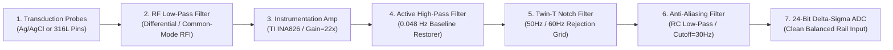

# 📡 Analog Front End (AFE) Hardware Blueprint
> **Document Status: Engineering Hardware Specification v1.0 (Production-Locked / Low-Noise Reference Schema)**

Biological substrates and low-frequency electromagnetic wave fields exhibit massive source impedance, low signal amplitudes, and extreme susceptibility to ambient human grid radiation. This blueprint defines the hardware constraints required to capture unvarnished analog environmental waveforms cleanly before they reach the digitization layer.

---

### 🛠️ 1. Analog Frontend Processing Chain Diagram

---

### 📋 2. Low-Noise Analog Subsystem Specifications

#### 📌 2.1 Instrumentation Amplifier Topology
*   **Component Selection:** Texas Instruments **INA826** instrumentation amplifier.
*   **Input Impedance:** $10^{10}\ \Omega$ ($10\ \text{G}\Omega$) differential input impedance. This prevents biological current draw and keeps input loading artifacts from clipping fragile plant or mycelial biopotentials.
*   **Common-Mode Rejection Ratio (CMRR):** Strictly optimized to **CMRR > 100 dB** at 50Hz/60Hz. This suppresses massive common-mode grid hum picked up by long sensor leads before it propagates down the gain stage.
*   **Gain Stage Setting:** Structured with an external low-drift metal film resistor ($R_g = 2.45\ \text{k}\Omega$, 0.1% tolerance, 15 ppm/°C) to lock an internal hardware amplification scale of exactly **22x**.

#### 📌 2.2 Power Rails & Reference Voltages
*   **Analog Supply:** Cleaned dual-rail $\pm 5.0\text{V}$ configuration generated via low-noise, ultra-low dropout (LDO) linear regulators (e.g., TI TPS7A47 / TPS7A33 series) to isolate the AFE entirely from digital switching transients. Ripple rejection must be $>80\text{dB}$ across the operating band.
*   **ADC Reference Voltage:** An isolated, low-drift $2.048\text{V}$ voltage reference (e.g., TI REF5020, $<3\text{ppm}/^\circ\text{C}$) establishes the absolute dynamic measurement ceiling for the 24-bit converter.
*   **HARDENING REMEDIATION: Fail-Safe Decoupling Matrix.** 
    Every IC must place a **0.1µF C0G Ceramic Capacitor** in parallel with a **10µF X7R Multi-Layer Ceramic Capacitor (MLCC)** directly adjacent to its physical power pins, completely eliminating volatile tantalum components to isolate the system from thermal runaway or fire hazards during short-circuit anomalies. Routing lengths must be bounded below **2.0 mm** to eliminate parasitic induction loops.

#### 📌 2.3 HARDENING REMEDIATION: Anti-Aliasing Input Filter Invariant
*   To prevent high-frequency environmental noise from aliasing back into the baseband during the 60Hz sampling pass, a differential first-order RC anti-aliasing low-pass filter must be inserted immediately before the input channels of the 24-bit Delta-Sigma ADC.
*   The filter uses matched **$10\ \text{k}\Omega$ (0.1%) series resistors** and a **$0.47\ \mu\text{F}$ C0G differential capacitor**, establishing a hard analog cutoff frequency of exactly **$33.8\ \text{Hz}$** (satisfying the Nyquist boundary for the 60Hz signal ingestion loop).

#### 📌 2.4 Hardware Pin & Signal Interconnect Matrix

| Physical Pin | Signal Identifier | Hardware Subsystem Connection | Electrical Operational Constraints |
| :--- | :--- | :--- | :--- |
| **GPIO Pin 5** | `ADC_CS_PIN` | Microcontroller Master Pin $\rightarrow$ ADC Chip Select | Output Active-Low. Toggled strictly within software loops. |
| **GPIO Pin 4** | `ADC_DRDY_PIN` | ADC Data Ready $\rightarrow$ Microcontroller Input | Input Pull-Up. Monitored via high-impedance clock gates. |
| **SCK Bus** | `SPI_SCK` | Hardware Serial Clock Bus | Output Uniform Pulse. Locked to Mode 1 (CPOL=0, CPHA=1). |
| **MOSI Lane** | `SPI_MOSI` | Master Out Slave In Configuration Lane | Output Command Word. Carries register bytes. |
| **MISO Lane** | `SPI_MISO` | Master In Slave Out Payload Lane | Input Data Word. Transmits signed 24-bit raw two's complement strings. |

---

### 🎛 `3`. Multi-Channel Hardware Multiplexer & Routing Schema

The external analog conversion framework steps through its physical ecological nodes sequentially using an array switching matrix configured according to these specific physical probe paths:

*   **Channel 1 (AIN0 / AIN1):** Tree Xylem Potential Probe (High-Impedance Differential Input)
*   **Channel 2 (AIN2 / AIN3):** Mycelium Subnetwork Alpha Potential Probe
*   **Channel 3 (AIN4 / AIN5):** Mycelium Subnetwork Beta Potential Probe
*   **Channel 4 (AIN6 / AIN7):** Local Extremely Low Frequency (ELF) Schumann Induction Coil Antenna

#### 📌 3.1 Inter-Channel Cross-Talk Mitigation (The 3W Rule)
Traces passing from the input protection terminal blocks to the active inputs of the multiplexer must maintain a physical track separation spacing constraint equal to a **minimum of 3x the trace width** (3W Rule). The positive (+) and negative (-) routing paths for each unique channel pair must be routed symmetrically as broad differential trace pairs, maintaining identical physical layer length bounds down to within **±0.05 mm** to preserve total phase cancellation integrity.

#### 📌 3.2 Physical Inter-Node Ground Loop Prevention
When capturing environmental signals across distinct spatial vectors, soil moisture differentials can introduce massive ground path voltage loops that skew data calculations. To mitigate this, each differential input node incorporates an isolated optocoupler barrier or a high-isolation instrumentation front-end, separating the remote probe grounding anchors entirely from the central processing digital ground plane.

---

### 📊 4. Operational Timing, Latency Budget & Field Calibration

To ensure predictable 60Hz frame compilation cadences, the low-level edge loop operates under a strict microsecond-bound execution budget:

*   **SPI Polling Clock:** Configured explicitly to **4,000,000 Hz (4 MHz)** inside `SPISettings`.
*   **Hardware Timeout Gate:** The `TIMEOUT_MICROS_LIMIT` variable sets a rigid **5,000 microseconds (5 ms)** cutoff ceiling for the high-impedance check on the `ADC_DRDY_PIN` pin. If a hardware fault occurs, the loop aborts instantly.
*   **Settling Window:** An intentional **2 microseconds (`delayMicroseconds(2)`)** physical delay is executed immediately after dropping the Chip Select line to allow the data lines on the FR4 layer to settle, eliminating crosstalk artifacts.
*   **HARDENING REMEDIATION: Dynamic Temperature-Compensated Field Calibration Loop.** 
    To protect against non-linear copper thermal drift in variable outdoor climates, an onboard I2C digital temperature sensor (e.g., TI TMP117, $\pm 0.1^\circ\text{C}$ accuracy) must monitor the AFE board temperature. The system executes a zero-offset baseline calibration at startup by grounding inputs AIN0-AIN7 locally across 1000 clock cycles, mapping the calibration coefficients to a 1D look-up table across temp curves, and dynamically updating active calibration parameters in memory to subtract thermal drift in real-time.

---

### 📐 5. High-Assurance PCB Layout Design Rules
1. **Star-Ground Plane Isolation:** The board must maintain two completely isolated ground planes: an **Analog Ground (AGND)** plane beneath the AFE components and a **Digital Ground (DGND)** plane beneath the microcontroller and SPI bus traces. The planes must tie together at exactly *one* physical star-ground point via a high-impedance ferrite bead.
2. **Parasitic Leakage Guard Rings:** Analog signal input traces leading to the INA826 pins must be tightly ringed by a continuous, non-soldermasked copper trace driven actively at the same potential as the input signal shield to short-circuit surface leakage currents.
