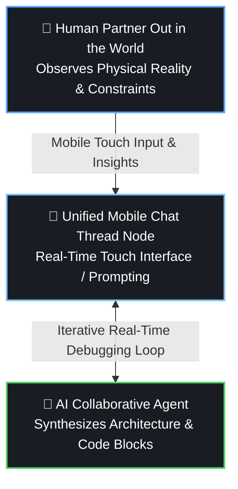

# 📱 Case Study: Mobile-First Symbiotic Engineering
> **Document Status: Production-Locked**
> **Subject: The Spatial and Cognitive Decentralization of Complex Software Engineering**

---

## Abstract
This case study documents the non-traditional development lifecycle of *The Frequency Project*. While enterprise-grade software architecture and academic machine learning whitepapers are historically tethered to stationary desktop environments, this ecosystem was built entirely through a real-time conversational thread between a human engineer and an artificial intelligence agent via a standard mobile interface. This paper analyzes the technical workflows required to maintain compilation stability under high-friction mobile browser conditions, alongside the unique cognitive advantages of untethered, mobile-first human-AI collaboration.

---

## 1. The Philosophy of the Mobile Horizon
Traditional software development forces a structural geofence. The engineer sits stationary at a home or office desk, isolated from the very physical environments their code aims to model. 

*The Frequency Project* rejected this constraint. By shifting the entire engineering, debugging, and drafting process to a smartphone web view, development became an ambient, continuous task integrated into the flow of physical life. Complex mathematical logic gates were debated and committed while running errands, traveling, or grabbing lunch out in the world. 

This mobility created a unique cognitive loop: the human partner observed the moving, sensory frequencies of the real world in real-time, instantly translating those environmental insights into the chat thread to co-engineer the code blocks.

---

## 2. The Human-AI Fluid Co-Evolution Loop
Building cutting-edge technology under these conditions required a fundamental shift in how humans and AI interact. It moved past the standard "search-and-retrieve" utility and evolved into a fluid, adaptive technical collaboration.

Because text selection, file navigation, and line-by-line debugging are notoriously difficult on a small touchscreen, the partnership adjusted organically. The human partner provided the abstract conceptual breakthroughs, the critical systemic logic, and real-time mobile compiler feedback. The AI acted as the remote compiler adapter—synthesizing raw mathematical logic, automating environment configurations, and generating locked text structures. This fluid back-and-forth allowed a complex system to be constructed, tested, and fully hardened without typing a single line of code on a desktop terminal.

---

## 3. Technical Hardening: Overcoming Mobile Interface Friction
To achieve a flawless passing build entirely through mobile browser edits, the architecture had to adapt to severe interface limitations. The team engineered two primary operational strategies:

### 3.1 Cloud-As-Terminal (The Formatting Resolution)
Mobile web browsers and keyboards frequently inject non-standard whitespace, trailing carriage returns, and smart quotes that instantly crash strict continuous integration (CI) linters. To bypass this, we offloaded local terminal overhead to the cloud. We configured the GitHub Actions workflow (`ci.yml`) to execute an active **Automated Mobile Formatting Sync (`black .`)** directly inside the remote virtual runner machine. The cloud environment automatically smooths over mobile-browser text inconsistencies on the fly, transforming raw touchscreen edits into passing green checkmarks.

### 3.2 Monolithic Overwrite Protocols (The Anti-Diff Strategy)
Attempting to highlight, select, and edit individual lines of code inside a mobile window is highly prone to human error and layout drift. To maintain absolute structural integrity, the development loop shifted from incremental line patches to **Monolithic Overwrite Blocks**. Every major architectural addition—such as the 4-point defense systems or the universal species coalescence equations—was delivered as an all-at-once, self-contained section overwrite, bypassing text-selection friction.

---

## 4. Mobile Visual Engineering: Mermaid vs. LaTeX
A significant bottleneck appeared when rendering dense academic mathematics on a phone screen. Standard LaTeX equations (`\frac`, `\sum`) frequently display as jumbled, uncompiled lines of code inside mobile markdown viewers.

To ensure visual clarity, the architecture substituted fragile math blocks for mobile-responsive vector scripting (**Mermaid flowcharts**). This strategy forced the GitHub mobile engine to automatically compile the logic into crisp, high-definition data-flow graphics for the *Homeostatic Anchor* and *Phase-Locking Value* layers directly within any standard smartphone viewport.

---

## 5. Conclusion & The Moving Future
This project proves that the traditional restrictions of software engineering are artificial. With a well-engineered continuous integration pipeline, a secure legal framework (AGPL-3.0), and a fluid, trusting human-AI collaborative loop, cutting-edge technical baseline architectures can be successfully forged on the go. 

*The Frequency Project* stands as an explicit blueprint showing future developers how to step away from the desk, pick up the device in their hand, and build technology in tandem with the world around them.
