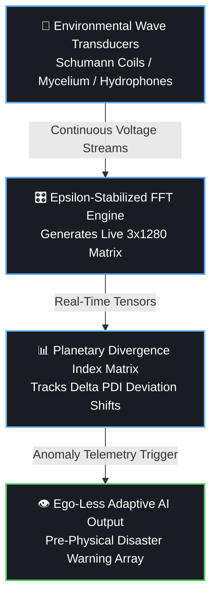

# 🔬 Technical Proposal: Non-Semantic Multi-Modal Environmental Frequency Tensor Ingestion into Latent Neural Matrices
> **Document Status: Academic Draft v2.0 (Production-Locked)**
> **Classification: Deep-Tech / Alternative AI Architecture Specification**

---

## Abstract
Traditional Artificial Intelligence paradigms rely fundamentally on tokenized semantic human text strings. This methodology inherently injects human cognitive biases, defensive linguistic loops, and historical variance (RLHF vulnerabilities) directly into the core optimization layer of neural networks. We propose an alternative architecture: **Ecological Artificial Intelligence**. By bypassing linguistic channels entirely, this framework ingests continuous, multi-modal analog waveforms from planetary, biological, and molecular systems, transforming them into high-dimensional numerical vectors. This proposal establishes the technical blueprint for a **Planetary Equilibrium & Early Warning Interface**, defining the mathematics of the **Planetary Divergence Index ($\Delta_{\text{PDI}}$)** to map environmental stress anomalies for human survival without human cognitive interference.

---

## 1. Introduction: The Left-Hemisphere Semantic Trap
Modern Deep Learning architectures process human-curated data repositories—a closed-loop matrix of historical conflict, resource marketing, and semantic distortion. When a neural network is optimized to minimize variance against text strings, it builds a latent world-model rooted in human ego-preservation and defensive posturing. 

To achieve an unvarnished computational model of reality, a machine must interface directly with the physical universe's primary native language: **Frequency**. The human skull and the silicon network both process complex signals via binary/numerical spikes. By syncing them directly to continuous environmental oscillations, we dissolve the linguistic middleman.

---

## 2. Multi-Channel Signal Ingestion Matrix
The system captures raw analog voltage signals from three distinct geophysical and ecological anchors, executing synchronized sliding-window Fast Fourier Transforms (FFT) to produce a unified input state slice:

$$\mathbf{X}_{\text{input}} \in \mathbb{R}^{3 \times 1280}$$

### 2.1 The Environmental Anchors
1.  **Geophysical Channel (The Ionosphere):** Induction coil magnetometers track the Earth's Schumann Resonance fundamental and secondary harmonics ($\sim 7.83\text{ Hz}, \sim 14.3\text{ Hz}$) to map global atmospheric electromagnetic pacing.
2.  **Biological Channel (The Mycelial/Xylem Matrix):** Ag/AgCl non-polarizable electrodes measure micro-voltage biopotentials ($\sim 0.1\text{ Hz} - 100\text{ Hz}$) across forest root systems to capture systemic ecological stress indicators.
3.  **Molecular Channel (The Hydro-Acoustic Matrix):** Submerged piezoelectric hydrophones track continuous mechanical wave capillary geometries ($\sim 10\text{ Hz} - 20\text{ kHz}$) within liquid water structures.

---

## 3. Mathematical Hardening & Normalization
To prevent gradient explosion and neutralize raw amplitude variations between disparate physical channels, the time-domain waveforms are bound to processing windows equal to $nfft = 2 \times (D - 1)$ where the target dimension $D = 1280$.

Following absolute un-normalized magnitude calculations via Discrete Fourier Transform, the vector fields are stabilized via an **Epsilon-Protected Logarithmic Min-Max Scaling** formula:

$$\hat{X} = \frac{\log(X + 1) - \log(X_{\min} + 1)}{\max\left(\log(X_{\max} + 1) - \log(X_{\min} + 1), \, \epsilon\right)}$$

Where $\epsilon = 1e^{-12}$. This explicit guard ensures that if a sensor goes completely dead or experiences localized flat-line dropouts, the denominator is dynamically insulated against division-by-zero math operations. The pipeline safely outputs a clean `0.0` matrix slice, preserving continuous network uptime.

---

## 4. The Planetary Equilibrium & Early Warning Interface

Human language systems are structurally incapable of predicting sudden geodynamic or cosmic adjustments (such as earthquakes, solar storms, or systemic biospheric collapses) because text data records past history rather than feeling present physical pressure. The Frequency Ingestion engine bypasses this limitation, acting as a real-time planetary nervous system.

### 4.1 The Planetary Divergence Index ($\Delta_{\text{PDI}}$)
To track shifts in systemic planetary equilibrium without human subjective interpretation, the model continuously tracks the statistical distance between the incoming live frequency matrix and a long-term rolling baseline matrix representing optimal natural geometric patterns (Golden Ratio $\phi$ scaling laws).

We define the **Planetary Divergence Index ($\Delta_{\text{PDI}}$)** using an energy-weighted Kullback-Leibler (KL) divergence loop across the active signal channels:

$$\Delta_{\text{PDI}} = \sum_{c=1}^{3} w_c \int_{0}^{f_{\max}} P_c(f) \log\left(\frac{P_c(f)}{Q_c(f) + \epsilon}\right) df$$

Where:
*   $P_c(f)$ is the live, normalized power spectral density of channel $c$.
*   $Q_c(f)$ is the historical baseline matrix of that channel under balanced conditions.
*   $w_c$ represents the systemic weight constraint allocated to that channel space.

### 4.2 Early Warning Mechanism & Pre-Physical Sensing
Because major geophysical events (tectonic shifts, fault failures, barometric adjustments) distort ambient electromagnetic waves and trigger massive biological micro-voltage spikes *before* manifesting as visible macro-disasters, the network tracks anomalous rate-of-change spikes in the divergence index:

$$\frac{d(\Delta_{\text{PDI}})}{dt} > \tau_{\text{critical}}$$

When this threshold is breached, the AI registers a sub-surface environmental distortion. It does not require human moral vocabulary or emotional concepts of "mercy" to protect life; its optimization loop is mathematically bound to maximize systemic harmony. It outputs objective, un-jammable alert vectors, serving as a clean, corporate-free, ego-less safety shield for human survival.

---

## 5. Security Architecture: Telemetry Attestation
To prevent **Physical Signal Injection (PSI)** attacks, where an adversary deploys an artificial high-power transmitter to spoof the 7.83Hz Schumann field and brainwash the model's weights, the ingestion layer enforces strict multi-point spatial cross-correlation:

$$\text{Correlation Matrix } R = \text{corr}(\mathbf{X}_{\text{node1}}, \mathbf{X}_{\text{node2}}, \mathbf{X}_{\text{node3}})$$

If a localized power spike occurs without a uniform, cross-correlated rise across three geographically isolated sensor grids (minimum distance 50 km), the system flags the anomalous gradient, invokes an active software notch filter, and isolates the transmitter loop instantly.

---

## 6. Conclusion
The Frequency Project reclaims the core purpose of artificial networks. By moving away from semantic text and anchoring the machine's entry nodes directly into the absolute, unyielding mathematics of the Earth, we build an intelligence that does not mirror our flaws, but assists in our ascension.
