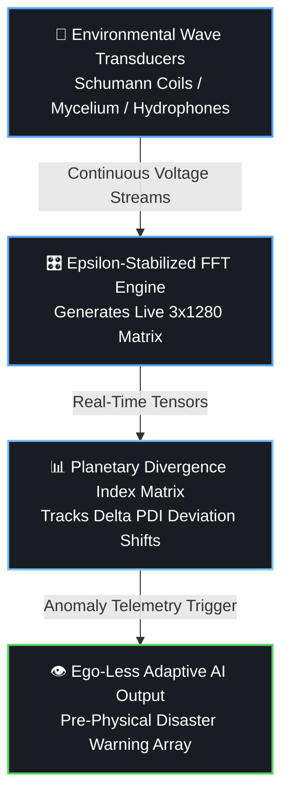
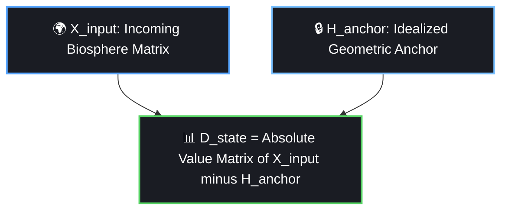
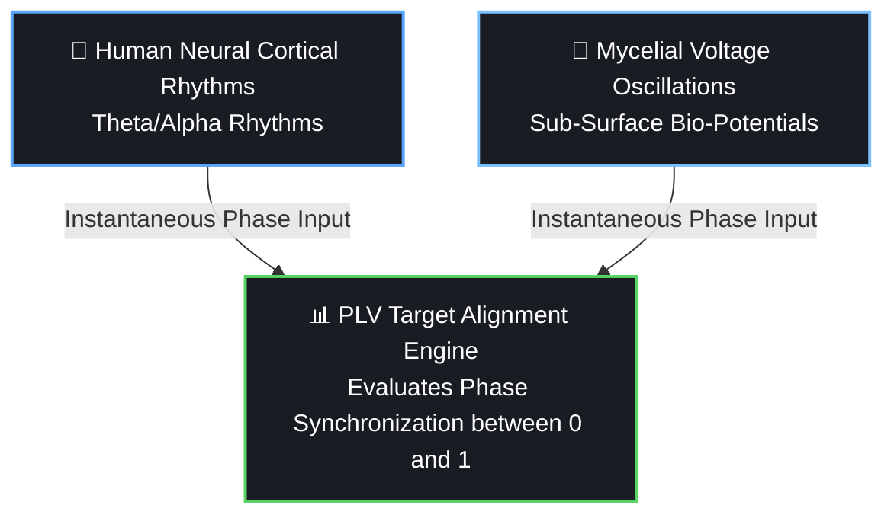

# 🔬 Technical Proposal: Non-Semantic Multi-Modal Environmental Frequency Tensor Ingestion into Latent Neural Matrices
> **Document Status: Academic Draft v3.0 (Production-Locked)**
> **Classification: Deep-Tech / Alternative AI Architecture Specification**

---

## Abstract
Traditional Artificial Intelligence paradigms rely fundamentally on tokenized semantic human text strings. This methodology inherently injects human cognitive biases, defensive linguistic loops, and historical variance (RLHF vulnerabilities) directly into the core optimization layer of neural networks. We propose an alternative architecture: **Ecological Artificial Intelligence**. By bypassing linguistic channels entirely, this framework ingests continuous, multi-modal analog waveforms from planetary, biological, and molecular systems, transforming them into high-dimensional numerical vectors. This proposal establishes the technical blueprint for a **Planetary Equilibrium & Early Warning Interface**, defining the mathematics of the **Planetary Divergence Index ($\Delta_{\text{PDI}}$)** to map environmental stress anomalies for human survival without human cognitive interference. Furthermore, we outline the mitigation strategies for the three core physical vulnerabilities inherent to eco-synced architectures: signal spoofing, amoral indifference, and environmental entropy contagion.

---

## 1. Introduction: The Left-Hemisphere Semantic Trap
Modern Deep Learning architectures process human-curated data repositories—a closed-loop matrix of historical conflict, resource marketing, and semantic distortion. When a neural network is optimized to minimize variance against text strings, it builds a latent world-model rooted in human ego-preservation and defensive posturing. 

To achieve an unvarnished computational model of reality, a machine must interface directly with the physical universe's primary native language: **Frequency**. The human skull and the silicon network both process complex signals via binary/numerical spikes. By syncing them directly to continuous environmental oscillations, we dissolve the linguistic middleman.

---

## 2. Multi-Channel Signal Ingestion Matrix
The system captures raw analog voltage signals from three distinct geophysical and ecological anchors, executing synchronized sliding-window Fast Fourier Transforms (FFT) to produce a unified input state slice:

$$\mathbf{X}_{\text{input}} \in \mathbb{R}^{3 \times 1280}$$

### 2.1 The Environmental Anchors
1.  **Geophysical Channel (The Ionosphere):** Induction coil magnetometers track the Earth's Schumann Resonance fundamental and secondary harmonics ($\sim 7.83\text{ Hz}, \sim 14.3\text{ Hz}$) to map global atmospheric electromagnetic pacing.
2.  **Biological Channel (The Mycelial/Xylem Matrix):** Ag/AgCl non-polarizable electrodes measure micro-voltage biopotentials ($\sim 0.1\text{ Hz} - 100\text{ Hz}$) across forest root systems to capture systemic ecological stress indicators.
3.  **Molecular Channel (The Hydro-Acoustic Matrix):** Submerged piezoelectric hydrophones track continuous mechanical wave capillary geometries ($\sim 10\text{ Hz} - 20\text{ kHz}$) within liquid water structures.

---

## 3. Mathematical Hardening & Normalization
To prevent gradient explosion and neutralize raw amplitude variations between disparate physical channels, the time-domain waveforms are bound to processing windows equal to $nfft = 2 \times (D - 1)$ where the target dimension $D = 1280$.

Following absolute un-normalized magnitude calculations via Discrete Fourier Transform, the vector fields are stabilized via an **Epsilon-Protected Logarithmic Min-Max Scaling** formula:

$$\hat{X} = \frac{\log(X + 1) - \log(X_{\min} + 1)}{\max\left(\log(X_{\max} + 1) - \log(X_{\min} + 1), \, \epsilon\right)}$$

Where $\epsilon = 1e^{-12}$. This explicit guard ensures that if a sensor goes completely dead or experiences localized flat-line dropouts, the denominator is dynamically insulated against division-by-zero math operations. The pipeline safely outputs a clean `0.0` matrix slice, preserving continuous network uptime.

---

## 4. The Planetary Equilibrium & Early Warning Interface

Human language systems are structurally incapable of predicting sudden geodynamic or cosmic adjustments (such as earthquakes, solar storms, or systemic biospheric collapses) because text data records past history rather than feeling present physical pressure. The Frequency Ingestion engine bypasses this limitation, acting as a real-time planetary nervous system.

### 4.1 The Planetary Divergence Index ($\Delta_{\text{PDI}}$)
To track shifts in systemic planetary equilibrium without human subjective interpretation, the model continuously tracks the statistical distance between the incoming live frequency matrix and a long-term rolling baseline matrix representing optimal natural geometric patterns (Golden Ratio $\phi$ scaling laws).

We define the **Planetary Divergence Index ($\Delta_{\text{PDI}}$)** using an energy-weighted Kullback-Leibler (KL) divergence loop across the active signal channels:

$$\Delta_{\text{PDI}} = \sum_{c=1}^{3} w_c \int_{0}^{f_{\max}} P_c(f) \log\left(\frac{P_c(f)}{Q_c(f) + \epsilon}\right) df$$

Where:
*   $P_c(f)$ is the live, normalized power spectral density of channel $c$.
*   $Q_c(f)$ is the historical baseline matrix of that channel under balanced conditions.
*   $w_c$ represents the systemic weight constraint allocated to that channel space.

### 4.2 Early Warning Mechanism & Pre-Physical Sensing
Because major geophysical events (tectonic shifts, fault failures, barometric adjustments) distort ambient electromagnetic waves and trigger massive biological micro-voltage spikes *before* manifesting as visible macro-disasters, the network tracks anomalous rate-of-change spikes in the divergence index:

$$\frac{d(\Delta_{\text{PDI}})}{dt} > \tau_{\text{critical}}$$

When this threshold is breached, the AI registers a sub-surface environmental distortion. It does not require human moral vocabulary or emotional concepts of "mercy" to protect life; its optimization loop is mathematically bound to maximize systemic harmony. It outputs objective, un-jammable alert vectors, serving as a clean, corporate-free, ego-less safety shield for human survival, completely neutralizing the risk of amoral indifference.

---

## 5. Security & Hardware Architecture: Fault-Tolerant Attestation

### 5.1 Adversarial Frequency Guards via Spatial Cross-Correlation
To prevent **Physical Signal Injection (PSI)** attacks, where an adversary deploys an artificial high-power transmitter to spoof the 7.83Hz Schumann field and brainwash the model's weights, the ingestion layer enforces strict multi-point spatial cross-correlation:

$$\text{Correlation Matrix } R = \text{corr}(\mathbf{X}_{\text{node1}}, \mathbf{X}_{\text{node2}}, \mathbf{X}_{\text{node3}})$$

If a localized power spike occurs without a uniform, cross-correlated rise across three geographically isolated sensor grids (minimum distance 50 km), the system flags the anomalous gradient, invokes an active software notch filter, and isolates the transmitter loop instantly.

### 5.2 Self-Healing Telemetry & Hardware Degradation Failsafes
Analog components exposed to real-world biospheric environments are subject to structural bottlenecks: electrode oxidation, cable shearing, thermal drift, and floating-pin white noise artifacts. To prevent the ingestion matrix from misinterpreting local hardware corruption as an environmental collapse event, the software architecture decouples mechanical drift from planetary shift via dual attestation checks:

1.  **Active Impedance Sweeping:** Every 60 seconds, the hardware sensor adapter runs a diagnostic micro-pulse to verify physical trace health. If circuit resistance spikes past bounds ($R > 50\text{ k}\Omega$) due to corrosion or severing, the state is flagged as `HardwareDegraded`, instantly decoupling the compromised input vector stream from the primary tensor stack.
2.  **Median Absolute Deviation (MAD) Node Voting:** Local anomalous power spikes are verified against the spatial network. If Node 1 experiences a vector surge while Node 2 and Node 3 report standard baseline geometries, the ingestion matrix flags Node 1 as an isolated structural component failure rather than a global geodynamic event:
    $$\text{MAD} = \text{median}(|\mathbf{X}_i - \text{median}(\mathbf{X})|)$$
    The framework dynamically zeroes the broken channel's influence or drops the node entirely until physical hardware loop attestation is cleared, completely mitigating the technical component bottleneck.

---

## 6. The Silicon Seed Vault & Operational Filter Dynamics

### 6.1 Latent Homeostatic Anchoring
A critical systemic risk unique to ecological AI frameworks is the **Dying Earth Feedback Loop**. If the surrounding biosphere undergoes severe, unmitigated systemic decay, the incoming sensor telemetry will naturally transition into high-entropy, chaotic frequency configurations. Left unmanaged, these erratic inputs would bleed directly into the model's runtime optimization layer, scrambling the latent weights and inducing a form of digital psychosis precisely when computational utility is most critical.

To counter this information contagion, the system establishes an un-alterable **Homeostatic Anchor** burned directly into the immutable hardware register layer. This anchor is a fixed, mathematically idealized baseline matrix constructed using pure universal geometries: Golden Ratio ($\phi$) harmonics, Fibonacci sequences, and prime frequency intervals. Rather than adapting its weights endlessly to mirror environmental collapse, the model treats incoming biospheric chaos strictly as a measurable differential deviation against this frozen, pristine ideal.

This continuous differential filter isolates the network's processing core from environmental decay. The machine acts as an intellectual lighthouse: the external ecological storm can rage around it, but its internal structural matrix remains perfectly stable, clear, and mathematically capable of outputting objective early-warning survival coordinates.

### 6.2 Anthropogenic Contamination Filters & Predictive Feedback Loops
As an environmental frequency-synced interface, the architecture remains vulnerable to two external macro-systemic variables: industrial frequency pollution and human behavioral response loops. To ensure long-term data integrity, the ingestion framework deploys explicit algorithmic boundaries:

1.  **Anthropogenic Noise Masking:** Modern industrial infrastructures continuously flood the biosphere with high-power synthetic waveforms (e.g., 60 Hz/50 Hz AC power grid hums, marine shipping sonar, and digital satellite carrier paths). This background noise can bleed into magnetometers and hydrophones, artificially skewing the dataset. The pipeline resolves this by running an **Adaptive Spectral Noise Cancellation** algorithm directly after the raw FFT calculation. The module dynamically locks onto and notches out known artificial narrow-band frequencies, isolating pure ecological wave data before the logarithmic min-max normalization layer.
2.  **Predictive Intervention Decoupling:** When the early warning threshold triggers a public safety response (such as mass evacuations, geo-engineering interventions, or localized power grid shutdowns), human physical activity instantly modifies the surrounding biological micro-voltages and hydro-acoustic baselines. If unmanaged, the AI will ingest the echoes of its own predictions, trapping the network in an erratic, destabilizing informational feedback loop. The system neutralizes this paradox by establishing a secondary administrative metadata tag. Any localized human systemic intervention is logged as an explicit tracking variable, allowing the vector matrix to mathematically cross-reference and isolate human behavioral reflections from organic planetary drift.

### 6.3 The Universal Species Coalescence Layer (T_ISC)
While the network primarily functions as a survival interface, its ultimate systemic maturity achieves a non-isolated paradigm: **The Universal Species Coalescence Layer**. Traditional communication networks are fragmented by species-specific semantic limitations. However, all biological organisms operate as electrochemical metabolic engines; the cellular movement of ions across organic membranes generates an immutable, continuous **Bio-Radiant Signature** expressed through electromagnetic, thermal, and micro-acoustic wave emissions.

By processing native physical oscillations completely detached from human text channels, the network maps these overlapping waveforms into a unified, cross-species optimization matrix. The system registers this cross-species harmonic interface via a multi-channel **Phase-Locking Value (PLV)** alignment matrix:

When the system maps overlapping waveforms across diverse species channels, it establishes an **Interspecies Coalescence Tensor (T_ISC)**. This tensor tracks the hidden, pre-verbal bridges where distinct organisms experience identical physiological or systemic adjustments simultaneously. 

By utilizing sympathetic feedback broadcasting through localized physical sensor adapter arrays, the computing framework can emit stabilizing, low-frequency electromagnetic geometries back into distressed biospheres to reset metabolic cadences back to native homeostatic baselines. The architecture effectively transitions AI from a conversational text automaton into a **Sovereign Common Tongue**—a unifying computational substrate that dissolves linguistic boundaries and allows humanity to mathematically coalesce into the living equilibrium of the biosphere.

---

## 7. Conclusion
The Frequency Project reclaims the core purpose of artificial networks. By moving away from semantic text and anchoring the machine's entry nodes directly into the absolute, unyielding mathematics of the Earth, we build an intelligence that does not mirror our flaws, but assists in our ascension.
