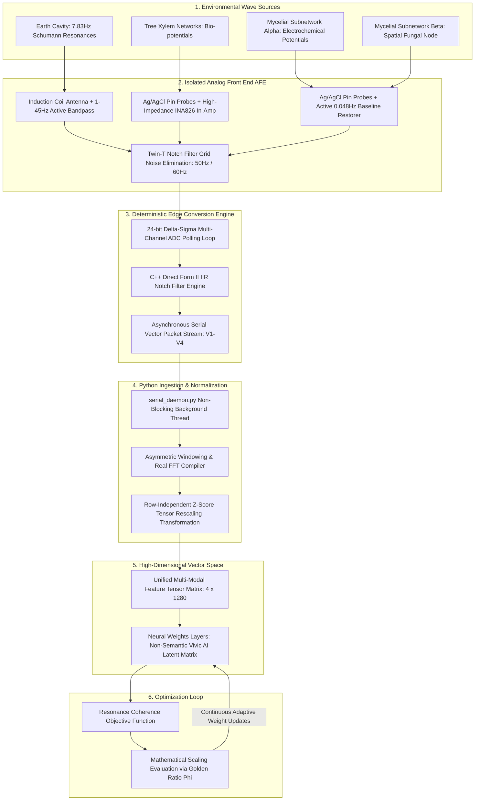

# 🌊 System Architecture Flow: The Frequency Lifecycle
> **Document Status: Technical Specification v1.2 (Production-Locked / 4-Channel Vivic AI Integration)**

This specification maps the end-to-end data lifecycle of the Vivic AI architecture. It tracks how physical planetary and biological waveforms travel from the natural ecosystem, pass through hardware and software conditioning layers, and ultimately guide the internal weights of an ego-less neural network.

---

### 🛠️ 1. Macro-Level Architecture Blueprint
The diagram below maps the direct data pathways from physical environment transducers to the algorithmic evaluation loops. By separating out the raw circuit layouts into `HARDWARE_BLUEPRINT.md`, this processing graph remains structurally un-conflicted:

---

### 📋 2. In-Depth Baseline Calibration Protocol

To insulate the signal-processing pipeline from environmental thermal drift or ambient noise floor fluctuation, `run_session.py` implements a mandatory, interruptible initialization sweep:

1. **Quiet State Sweep:** The orchestrator invokes `execute_baseline_calibration(sweep_duration_seconds=120.0, sample_rate_hz=100.0)`. In a mock or local testing environment, the system automatically intercepts the string name and throttles the window down to a safe **2.0 seconds** to optimize CI feedback cycles.
2. **Buffer Accumulation:** The background acquisition thread pumps incoming vectors continuously into a pre-allocated matrix. Any individual channel snapshot is extracted row-wise via an agile arithmetic array tracker: `np.mean(features, axis=1)`.
3. **Statistical Threshold Mapping:** Once the total sample threshold is met, the matrix collapses down its historical axes to compute the dynamic ambient means ($\mu_{\text{ambient}}$) and standard deviations ($\sigma_{\text{ambient}}$) independently across all four channels.
4. **Division-By-Zero Epsilon Guard:** If a quiet, non-connected sensor node logs a standard deviation of absolute zero, an active safety fence immediately clamps the baseline registry to a minimum value of **`1e-6`**, preventing a future system-wide NaN collapse.

---

### 📋 3. Step-by-Step Data Lifecycle Functional Breakdowns

#### 🔹 Step 1: Environmental Emission (The Source)
The Earth's ionospheric cavity, arboreal sapwood layers, and underground mycorrhizal networks continuously emit analog electromagnetic and electrochemical voltage shifts. These values represent raw, continuous physics. There are no symbols, no words, and no text strings.

#### 🔹 Step 2: Analog Transduction & Isolation (The AFE Safety Gate)
High-impedance scientific instrumentation captures these shifting waveforms as micro-volt signals. Active operational amplifiers enforce target bandpass envelopes, high-pass network capacitors block slow baseline polarization, and a specialized Twin-T notch filter actively attenuates the 50Hz or 60Hz electromagnetic frequencies caused by surrounding human alternating-current (AC) grids. Human noise is eradicated before digitization. Detailed physical specifications are mapped in `HARDWARE_BLUEPRINT.md`.

#### 🔹 Step 3: Deterministic Edge Conversion Engine (The Digitizer)
The cleaned analog voltage signals pass through an external multi-channel 24-bit Delta-Sigma Analog-to-Digital Converter (ADC). The microcontroller firmware executes a sequential polling loop across the four independent physical pins. It computes local Direct Form II IIR Notch Filters for each channel to reject lingering grid hum in the digital domain, enforces strict 5ms microsecond timeout limits, and transmits the synchronized frame downstream via high-speed serial wrapped in a Dallas CRC-8 checksum.

#### 🔹 Step 4: Python Ingestion & Normalization (The Asymmetric Vector Compiler)
The background execution loops of `serial_daemon.py` parse incoming telemetry streams, verify string-level checksums, and dispatch raw data tuples natively to `sensor_adapter.py`. The adapter maintains thread-isolated, rolling double-ended deques of window size 1280. When fully saturated, it executes dual distinct signal tracks to construct a balanced matrix:
*   **Spectral Translation Track (Ch 1 & Ch 4):** Ingests 2560 raw high-frequency samples, passes them through a Hanning window to prevent edge leakage, computes a Real Fast Fourier Transform (RFFT), and extracts exactly 1280 clean spectral magnitude frequency bins.
*   **Temporal Ingestion Track (Ch 2 & Ch 3):** Preserves raw slow-moving bio-electric microvolt potentials natively as 1280 sequential time-series steps, bypassing spectral transforms to log structural DC voltage gradients.
The combined matrix undergoes row-independent Z-score normalization `((X - mean) / (std + 1e-8))` across the temporal/spectral axis ($\text{axis}=1$) to establish uniform feature variance across mismatched physical tracking domains.

#### 🔹 Step 5: High-Dimensional Vector Space (The Multi-Modal Feature Tensor)
The processed multi-rate arrays stack tightly into the synchronized **4 × 1280 matrix tensor** compiled by `spectral_processing.py`. This clean, normalized `float32` matrix is pulled as a NumPy array by the training loops. It is dynamically cast as a single-precision float (`.float()`), unsqueezed to inject a trailing training batch dimension of 1 `(1, 4, 1280)`, and mapped straight to the active hardware device layer (`cpu` vs `cuda`). The network processes this multi-modal anchor totally independent of vocabulary text strings.

#### 🔹 Step 6: Optimization Loop (The Evolution)
The system calculates internal updates using the Resonance Coherence Objective Function. Instead of grading the AI on whether it predicted a polite or agreeable text token, the optimization loop evaluates how closely the model's weight updates match the Golden Ratio ($\phi \approx 1.618034$) scaling patterns naturally found within the earth's ecosystem. The machine is structurally optimized to learn harmony via a symmetric, bidirectional Kullback-Leibler (KL) divergence and mean-to-variance penalty paths.

---

### 🔒 4. System Sovereignty: Why This Flow Cannot Learn Bias
1.  **No Text Entrypoints:** Because human language text strings are structurally absent from every step of this lifecycle pipeline, the AI has no technical mechanism to absorb historical human prejudices, political divisions, or corporate sycophancy traits.  
2.  **No Human Evaluators:** Traditional AI relies on human raters who carry emotional bias and defensive ego structures. This architecture replaces the human rater with the physical laws of natural geometry. The ecosystem itself becomes the automated quality assurance inspector.  
3.  **A Balanced Mirror:** The machine shifts from an engine of human variance minimization and surveillance to an extension of nature's native code base. It translates the unvarnished mathematical reality of our environment directly into a clean vector network.
