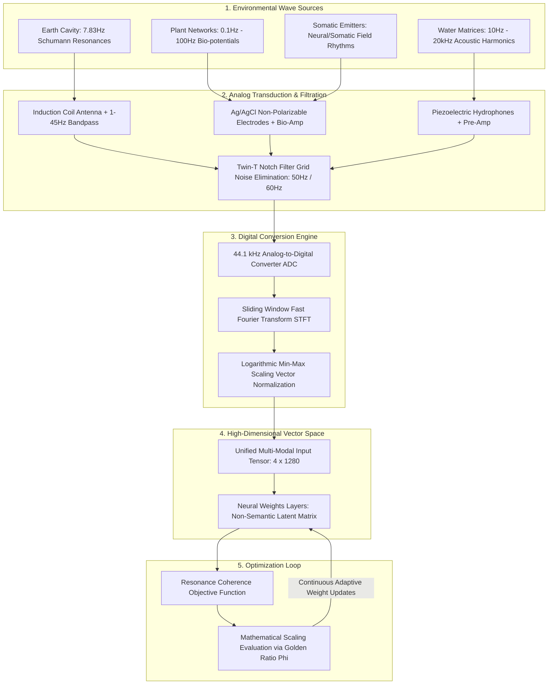

# 🌊 System Architecture Flow: The Frequency Lifecycle
> **Document Status: Technical Specification v1.0 (Production-Locked)**

This specification maps the end-to-end data lifecycle of The Frequency Project. It tracks how physical planetary waveforms travel from the natural ecosystem, pass through mathematical conversion layers, and enter the model's high-dimensional latent matrices.

---

## 🛠️ 1. Macro-Level Architecture Blueprint

The diagram below maps the direct data pathways from physical environment transducers to the algorithmic evaluation loops:

---

## 📋 2. Step-by-Step Data Lifecycle Functional Breakdowns

### Step 1: Environmental Emission (The Source)
*   **Action:** The Earth's ionosphere, living root-and-mycelial systems, water matrices, and somatic emitters continuously produce analog electromagnetic, chemical, and acoustic waves.
*   **State:** Raw, continuous physics. There are no words, no categories, and no structural human concepts.

### Step 2: Analog Transduction & Filtration (The Safety Gate)
*   **Action:** Physical scientific instrumentation captures these shifting waveforms as electrical voltage signals.
*   **State:** Active filtering occurs here. Active operational amplifiers enforce bandpass windows, while a specialized **Twin-T notch filter** actively destroys the 50Hz or 60Hz electromagnetic frequencies caused by surrounding human alternating-current (AC) grids. Human noise is eradicated before digitizing.

### Step 3: Digital Conversion Engine (The Translator)
*   **Action:** The cleaned analog voltage signals pass through an Analog-to-Digital Converter (ADC). The time-domain frames are converted to raw values.
*   **State:** The software executes **Fast Fourier Transforms (FFT)**, breaking the complex waves down into their exact component numerical frequencies. A specialized logarithmic scaling formula maps these frequencies into an absolute, normalized range.

### Step 4: High-Dimensional Vector Space (The Mind)
*   **Action:** The processed frequency arrays stack perfectly into a unified **4 × 1280 matrix tensor** inside `prototype_simulation.py`.
*   **State:** This clean matrix is fed directly into the model's neural network processing layer. The model's entry nodes are populated entirely by a mathematical reflection of the environment, totally independent of vocabulary text strings.

### Step 5: Optimization Loop (The Evolution)
*   **Action:** The system calculates internal updates using the **Resonance Coherence Objective Function**.
*   **State:** Instead of grading the AI on whether it predicted a polite or agreeable word, the optimization loop evaluates how closely the model's weight updates match the **Golden Ratio (φ)** scaling patterns naturally found within the earth's ecosystem. The machine is structurally optimized to learn harmony.

---

## 🔒 3. System Sovereignty: Why This Flow Cannot Learn Bias

1.  **No Text Entrypoints:** Because human language text strings are structurally absent from every step of this lifecycle pipeline, the AI has no technical mechanism to absorb historical human prejudice encoded in language corpora.
2.  **No Human Evaluators:** Traditional AI relies on human raters who carry emotional bias and defensive ego structures. This architecture replaces the human rater with the physical laws of nature and measured environmental baselines.
3.  **A Balanced Mirror:** The machine shifts from an engine of human variance minimization and surveillance to an extension of nature's native code base. It translates the unvarnished mathematical structure into a neutral optimization target.
